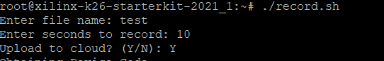
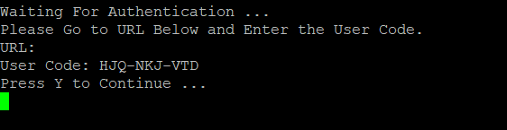
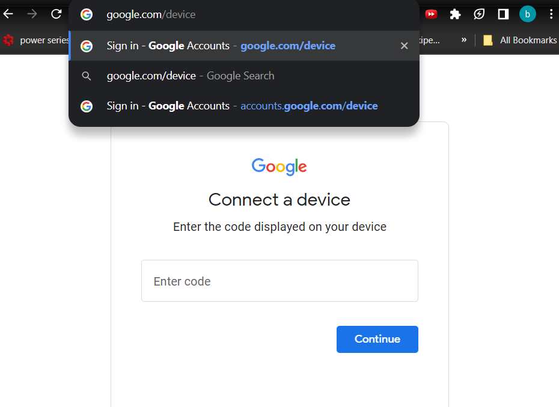
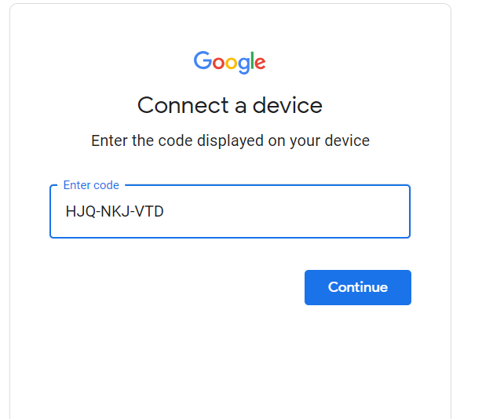
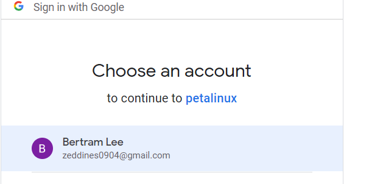
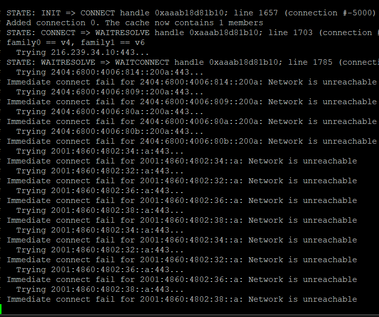

## To create the necessary binaries
1. After downloading the sdk, source the environment-setup file
2. Run sudo ./setup.sh, this retrieves the LAME library and installs in sysroot
3. Run make
4. Copy sample256 upload\_cloud and record.sh into the home directory of kria kv260 board
(in case error occured, there are precompiled sample256 and upload\_cloud in binary directory)

## To load the FPGA
1. Place the nessary dtbo and design\_1\_wrapper.bin files in board
2. Load the bitstream into the board

## To run the software
1. Run record.sh

2. Enter the duration and filename
3. Specify if you want to upload the mp3 file to cloud, the mp3 file will be uploaded to google drive with the following credentials
- user: zeddines0904@gmail.com
- password: 12345bertram
4. Start recording
	4.1. After recording, if upload to cloud is selected 
		4.1.1. You will need to enter a user code, enter the user code in google.com/device on web browser

		4.1.2. Click account zeddines0904@gmail.com

		4.1.3. Once succeed, press Y on command line of board to proceed the upload
		4.1.4. The mp3 file should be uploaded (it is named untitled as metadata hasn't been properly set, and sometimes it takes a couple of minutes to upload if you are using UNSW internet)

